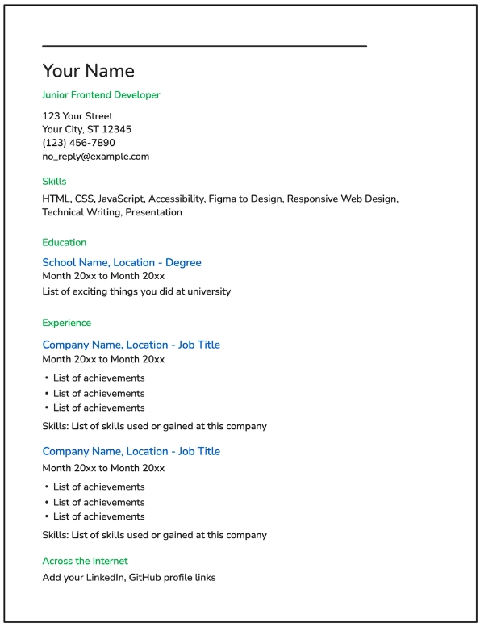
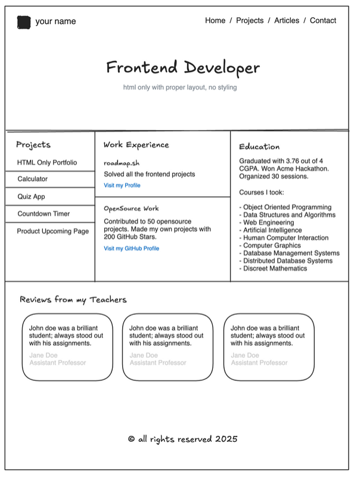
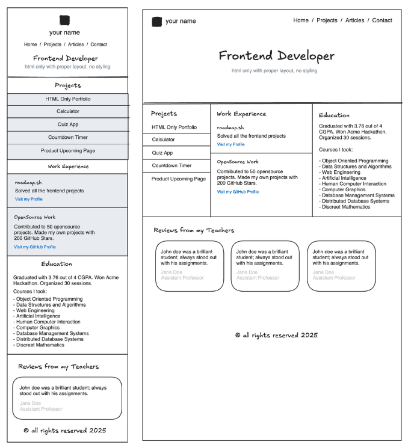
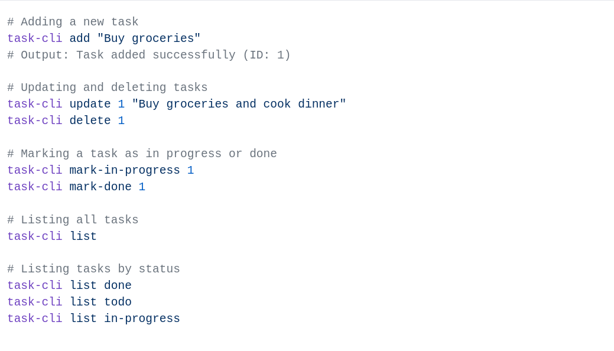

# Front-end Projects from Roadmap.sh

This repository contains front-end projects built by following the
[roadmap.sh](https://roadmap.sh/) Front-end Developer path.

## Projects List
- [Single Page CV](https://roadmap.sh/projects/single-page-cv)
- [Basic HTML Website](https://roadmap.sh/projects/basic-html-website)
- [Personal Portfolio](https://roadmap.sh/projects/portfolio-website)

Click any of the images below to view the source code of each project.

  
 

   

  

---

# Back-end Projects from Roadmap.sh

This repository contains back-end projects built by following the
[roadmap.sh](https://roadmap.sh/) Back-end Developer path.

## Projects List
- [Task Tracker](https://roadmap.sh/projects/task-tracker)

Click any of the images below to view the source code of each project.

  

